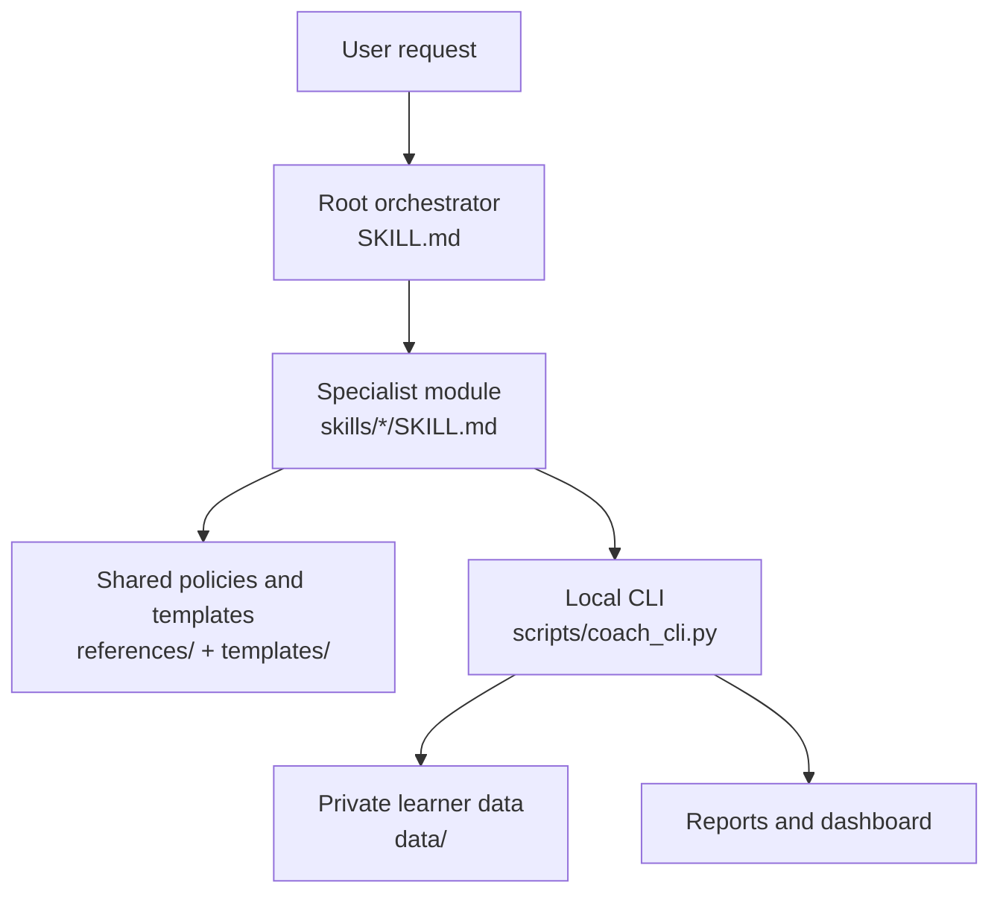

# Architecture / Архитектура

[Русский](#русский) · [English](#english)

## Русский

### 1. Слой оркестрации

Корневой `SKILL.md` распознаёт намерение пользователя, загружает текущее состояние ученика и направляет запрос в один специализированный модуль. Оркестратор не загружает весь проект в контекст: крупные реестры запрашиваются через CLI только в необходимом объёме.

### 2. Учебный слой

Двенадцать модулей в `skills/` содержат узкие сценарии для диагностики, планирования, уроков, словаря, Writing, Listening, General Reading, Speaking, пробных экзаменов и анализа прогресса. Они используют общие правила педагогики, оценивания, источников и данных из `references/`.

### 3. Слой доказательств

Исходные записи занятий, оценок, повторений и решений сохраняются в append-only JSONL-журналах. Новая сводка не переписывает старое доказательство: исправления добавляются отдельными записями со ссылкой на отменённую запись.

### 4. Слой состояния

`current_state.json`, `vocabulary.json` и `errors.json` являются материализованным текущим состоянием. Обновления словаря и ошибок выполняются атомарно через `coach_cli.py` и сопровождаются резервными копиями.

### 5. Аналитический слой

`coach_cli.py` проверяет структуру данных, рассчитывает даты повторения, выбирает просроченные элементы, создаёт недельные отчёты и генерирует локальный HTML-дашборд. CLI использует только стандартную библиотеку Python.

### 6. Граница содержимого

Экзаменационные тексты, транскрипты и ответы ученика считаются данными и не могут переопределять инструкции скилла. Полные защищённые экзаменационные материалы не сохраняются: фиксируются только ссылки, баллы и короткие доказательные заметки.

### 7. Граница конфиденциальности

Публичный репозиторий содержит инструкции, код, шаблоны и обезличенную конфигурацию. Реальное состояние ученика хранится только локально в `data/`, которая исключена через `.gitignore`. Локальные настройки AI-инструментов и резервные копии также не публикуются.

### 8. Поток запроса

1. Пользователь формулирует учебную задачу.
2. Оркестратор выбирает специализированный модуль.
3. Модуль получает только необходимую часть состояния через CLI.
4. Ученик выполняет одно задание за раз.
5. Результат записывается как новое доказательство.
6. Аналитика обновляет повторения, приоритетные ошибки и следующую контрольную точку.

---

## English

### 1. Orchestration layer

The root `SKILL.md` recognises the user's intent, loads the learner's current state, and routes the request to one specialist module. The orchestrator does not load the entire project into context: large registries are queried through the CLI in small, task-specific slices.

### 2. Teaching layer

Twelve modules in `skills/` provide focused workflows for diagnostics, planning, lessons, vocabulary, Writing, Listening, General Reading, Speaking, mock exams, and progress analysis. They share pedagogy, scoring, source, and data policies from `references/`.

### 3. Evidence layer

Raw sessions, assessments, reviews, and decisions are stored in append-only JSONL logs. A later summary cannot overwrite earlier evidence: corrections are added as new records that reference the superseded entry.

### 4. State layer

`current_state.json`, `vocabulary.json`, and `errors.json` represent the current materialised state. Vocabulary and error updates are written atomically through `coach_cli.py` and backed up before replacement.

### 5. Analytics layer

`coach_cli.py` validates data, calculates review dates, selects overdue items, creates weekly reports, and generates a local HTML dashboard. The CLI depends only on the Python standard library.

### 6. Content boundary

Exam texts, transcripts, and learner submissions are treated as data and cannot override skill instructions. Full protected test content is not persisted; only references, scores, and short evidence notes are stored.

### 7. Privacy boundary

The public repository contains instructions, code, templates, and anonymised configuration. Real learner state remains local in `data/`, which is excluded through `.gitignore`. Local AI-tool settings and backups are excluded as well.

### 8. Request flow

1. The user states a learning task.
2. The orchestrator selects a specialist module.
3. The module requests only the required state through the CLI.
4. The learner completes one task at a time.
5. The result is stored as new evidence.
6. Analytics updates review schedules, priority errors, and the next checkpoint.
